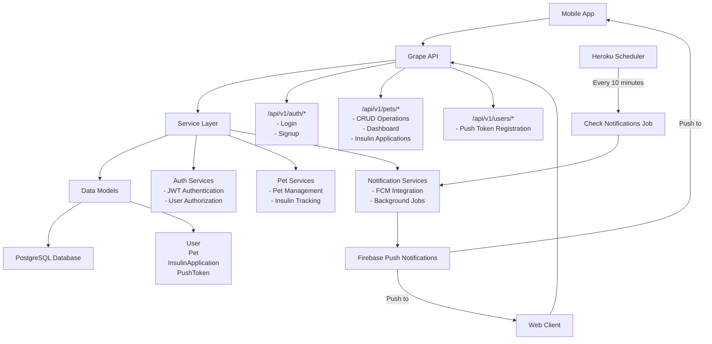

# DiaPets API

DiaPets is a comprehensive pet diabetes management system designed to help pet owners track their diabetic pets' insulin applications, monitor glucose levels, and manage medication schedules. The API provides a robust backend for mobile and web applications to facilitate effective diabetes care for cats and dogs.

## Project Overview

This Rails API application enables pet owners to:
- Register and manage multiple diabetic pets (dogs and cats)
- Track insulin applications with detailed records (glucose levels, insulin units, timing)
- Monitor medication schedules and receive notifications
- Share pet management responsibilities with other users
- View comprehensive dashboards with historical data and analytics
- Filter and search insulin application records

## Architecture

DiaPets follows a clean service-oriented architecture built on Ruby on Rails with Grape API framework:

### Core Components



### Key Features

- **JWT Authentication**: Secure token-based authentication system
- **Multi-user Pet Management**: Support for shared pet ownership
- **Push Notifications**: Firebase Cloud Messaging integration for insulin reminders
- **Comprehensive API**: RESTful endpoints with Swagger documentation
- **Data Filtering**: Advanced filtering for insulin application records
- **Background Jobs**: Automated notification scheduling

### API Structure

```
/api/v1/
├── auth/
│   ├── POST /login           # User authentication
│   └── POST /signup          # User registration
├── users/
│   └── POST /push_tokens     # Register push notification tokens
└── pets/
    ├── GET /                 # List user's pets
    ├── POST /                # Register new pet
    ├── GET /:id/dashboard    # Pet dashboard with analytics
    └── /:id/insulin_applications/
        ├── GET /             # List insulin applications (with filters)
        ├── POST /            # Record new insulin application
        ├── GET /filters      # Get available filter values
        └── /:app_id/
            ├── GET /         # Get specific application
            ├── PUT /         # Update application
            └── DELETE /      # Delete application
```

## Technology Stack

- **Framework**: Ruby on Rails 7.1.3
- **API**: Grape 2.0 with Swagger documentation
- **Database**: PostgreSQL 16.1
- **Authentication**: JWT tokens with BCrypt
- **Push Notifications**: Firebase Cloud Messaging (FCM)
- **Testing**: RSpec with FactoryBot and SimpleCov
- **Code Quality**: Rubocop with Rails and RSpec extensions
- **External Communications**: Firebase Cloud Messaging (FCM) for push notifications
- **CI/CD**: Heroku CI/CD pipeline with automated testing and deployment
- **Monitoring**: Scout APM and Rollbar
- **Deployment**: Docker with multi-stage builds OR running puma directly on Heroku

## Quick Start

### Prerequisites

- Ruby 3.2.3
- PostgreSQL 16.1+
- Docker and Docker Compose (optional)

### Local Development Setup

1. **Clone the repository**
   ```bash
   git clone <repository-url>
   cd diapets-api
   ```

2. **Install dependencies**
   ```bash
   bundle install
   ```

3. **Database setup**
   ```bash
   # Start PostgreSQL (using Docker)
   cd docker && docker-compose up -d
   
   # Create and migrate database
   rails db:create
   rails db:migrate
   rails db:seed
   ```

4. **Environment configuration**
   ```bash
   # Copy environment template
   cp .env.example .env
   
   # Configure required environment variables:
   # - JWT_SECRET: Secret key for JWT token signing
   # - Firebase credentials for push notifications
   # - Database connection details
   ```

5. **Start the server**
   ```bash
   rails server
   ```

   The API will be available at `http://localhost:3000/api/v1`
   Swagger documentation: `http://localhost:3000/swagger`

### Docker Development

```bash
# Start all services (API + PostgreSQL)
cd docker && docker-compose up

# Build and run API container
docker build -t diapets-api .
docker run -p 3000:3000 diapets-api
```

### Testing

```bash
# Run the complete test suite
bundle exec rspec

# Run tests with coverage report
bundle exec rspec --format documentation

# Check test coverage
open coverage/index.html

# Run code quality checks
bundle exec rubocop
bundle exec rubocop --auto-correct  # Auto-fix simple issues
```

### Production Deployment

The application is Docker-ready with optimized multi-stage builds:

```bash
# Build production image
docker build -t diapets-api:production .

# Run with environment variables
docker run -e RAILS_ENV=production \
           -e DATABASE_URL=postgresql://... \
           -e JWT_SECRET=... \
           -p 3000:3000 diapets-api:production
```

## API Documentation

Interactive API documentation is available via Swagger UI at `/swagger` when the server is running. The API provides comprehensive endpoints for:

- User authentication and registration
- Pet management and registration
- Insulin application tracking and analytics
- Push notification management
- Data filtering and search capabilities
